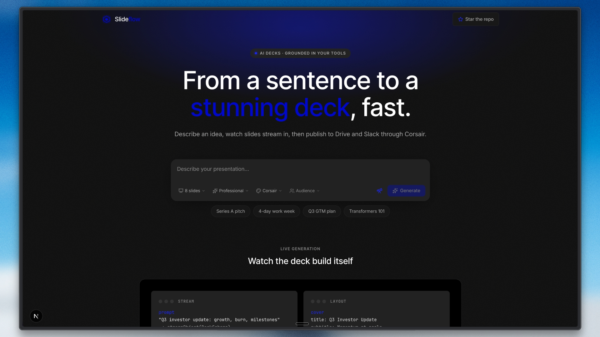

# Slideflow

**From a sentence to a stunning deck — live.**

Slideflow is an open-source AI presentation studio. Describe an idea in plain language, watch slides stream in as they are written, edit any text inline, present fullscreen, and export to PDF or PowerPoint. Optional [Corsair](https://corsair.dev/) integrations ground decks in live web research, import source material from Google Drive, and publish finished PDFs back to Google Drive — with zero OAuth code in this repo.

---

## Table of contents

- [Why Slideflow](#why-slideflow)
- [Features](#features)
- [How it works](#how-it-works)
- [Quick start](#quick-start)
- [Configuration](#configuration)
- [Corsair integrations](#corsair-integrations)
- [Slide layouts & themes](#slide-layouts--themes)
- [Architecture](#architecture)
- [Tech stack](#tech-stack)
- [Troubleshooting](#troubleshooting)
- [Production notes](#production-notes)

---

## Why Slideflow

Most AI slide tools either dump commands into Google Slides or return a static file you cannot touch until generation finishes. Slideflow takes a different path:

| | Typical slide agent | **Slideflow** |
|---|---|---|
| Output | External doc or flat export | Native 1280×720 slides rendered in-app |
| Feedback loop | Wait, then open elsewhere | Slides **stream in live** as the model writes |
| Design | Default template styling | **7 designer themes**, **10 layouts**, optional AI art |
| Editing | Re-prompt from scratch | **Click any text to edit** inline |
| Present | Open in another app | Built-in **fullscreen present mode** + speaker notes |
| Export | Single format | **PDF & PPTX** locally; optional **publish to Google Drive** via Corsair |
| Research | Manual copy-paste | Optional **live web research** before generation |

The name reflects the core experience: slides **flow** into view one by one while you watch the narrative take shape.

---

## Features

### Generation

- **Streaming structured output** — decks are built with the Vercel AI SDK `streamObject` and a Zod schema, so partial slides render the moment their fields arrive.
- **Layout-aware prompting** — the model is instructed to vary layouts (stat, quote, timeline, two-column, etc.), keep copy concise, and never stash visible content in speaker notes.
- **Live research** — when Corsair is configured, Exa / Tavily / Firecrawl pull real facts before the deck is written; facts are woven into stats, bullets, and spotlight slides.
- **Content normalization** — `normalizeSlide()` backfills layout fields when the model omits them and promotes misplaced speaker-note text into the correct on-slide fields.

### Studio

- **Slide sidebar** — thumbnails with layout previews and image-generation status.
- **Inline editing** — click any headline, bullet, or body paragraph to edit; changes persist in local state.
- **Present mode** — fullscreen playback with keyboard navigation.
- **Regenerate** — tweak the brief (slides, tone, theme, audience, research) and run again.

### Visual design

- **7 themes** — Corsair, Midnight, Aurora, Editorial, Solaris, Sapphire, Mono. Each defines palette, typography, and CSS gradient art.
- **10 layouts** — cover, section, bullets, two-column, comparison, stat, quote, timeline, spotlight, closing.
- **AI background art** (optional) — Google Gemini generates abstract editorial imagery for every layout; without a Gemini key, slides fall back to built-in CSS art at zero cost.

### Export & publish

- **PDF** — client-side render via `html-to-image` + `jspdf` (pixel-perfect snapshots of the 1280×720 canvas).
- **PPTX** — native editable PowerPoint via `pptxgenjs` (text-based, not screenshots).
- **Publish & Share** (Corsair) — upload PDF to Google Drive and create a shareable link in one flow.

---

## How it works

```
Landing (/)                Studio (/studio)
─────────────              ───────────────────────────────────
Composer                   useObject → POST /api/generate
  · prompt                   · optional Corsair research
  · slides / tone            · streamObject(DeckSchema)
  · theme / audience         · merge + normalize partial slides
  · research toggle          · render SlideView per layout
       │                     · optional Gemini images (/api/image)
       ▼                     · export PDF / PPTX / publish
  stashRequest → navigate
```

1. You describe a presentation on the landing page and click **Generate**.
2. The brief is stashed in `sessionStorage` and you are routed to `/studio`.
3. `experimental_useObject` streams a partial `Deck` JSON object from `/api/generate`.
4. Each slide renders as soon as its `title`, `layout`, and content fields arrive.
5. After generation completes, Gemini (if configured) paints background art per slide.
6. Edit, present, or export — or publish through Corsair.

---

## Quick start

### Prerequisites

- Node.js 20+
- `pnpm` (recommended) or `npm`

### Install & run

```bash
git clone https://github.com/Arindam200/slideflow.git
cd slideflow

pnpm install
cp .env.example .env.local
```

Add at minimum **one model API key** to `.env.local` (see [Configuration](#configuration)), then:

```bash
pnpm dev
```

Open [http://localhost:3000](http://localhost:3000).

---

## Configuration

Copy `.env.example` to `.env.local`. Never commit `.env.local`.

### Model provider (required — pick one)

Slideflow generates deck **text and structure** through the Vercel AI SDK. Provider priority:

| Priority | Variable | Default model |
|---|---|---|
| 1 (recommended) | `NEBIUS_API_KEY` | `nvidia/Nemotron-3-Nano-Omni` |
| 2 | `ANTHROPIC_API_KEY` | `claude-sonnet-4-6` |
| 3 | `OPENAI_API_KEY` | `gpt-4.1` |

```bash
# Get a key at https://tokenfactory.nebius.com
NEBIUS_API_KEY=your_key_here
```

**Optional model overrides:**

```bash
DECK_MODEL=meta-llama/Llama-3.3-70B-Instruct-fast
NEBIUS_BASE_URL=https://api.tokenfactory.nebius.com/v1
DECK_STRUCTURED_OUTPUTS=false   # fall back to json_object if schema streaming breaks
```

> **Avoid reasoning models** (`…-Thinking`, `DeepSeek-R1`, etc.) for generation. Their chain-of-thought tokens corrupt the streamed JSON.

### Slide imagery (optional)

Background art uses **Google Gemini**, separate from the text model:

```bash
# https://aistudio.google.com/apikey
GOOGLE_GENERATIVE_AI_API_KEY=your_key_here
IMAGE_MODEL=gemini-3.1-flash-image   # optional override
```

Without this key, all slides use CSS gradient art — fully functional, zero image API cost.

### Corsair (optional)

Unlocks live research, Google Drive import, and Google Drive publishing:

```bash
CORSAIR_DEV_KEY=ch_...
CORSAIR_INSTANCE_ID=6132b26323564e61aef09416e11eeb21   # opaque instance id from dashboard
CORSAIR_TENANT_ID=your-tenant-id                        # optional; defaults to first tenant
```

See [Corsair integrations](#corsair-integrations) for setup details.

### Site (optional)

```bash
NEXT_PUBLIC_GITHUB_REPO=https://github.com/Arindam200/slideflow
```

Powers the **Star the repo** header link on the landing page.

---

## Corsair integrations

[Corsair](https://corsair.dev/) is the integration layer — not the product name. Slideflow uses the hosted SDK (`@corsair-dev/app`) via `tenant.run(...)` with no OAuth implementation in this repo.

### Live research

Before generation, Slideflow can query connected web plugins:

| Plugin | Path |
|---|---|
| Exa | `exa.api.search.search` |
| Tavily | `tavily.api.search.search` |
| Firecrawl | `firecrawl.api.search.run` |

Research snippets are passed into the generation prompt so slides cite real numbers, dates, and names. Toggle **Research** in the composer, or leave Corsair configured — research runs automatically when the integration is available.

**API:** `POST /api/research` · **Code:** `src/lib/research.ts`, `src/app/api/research/route.ts`

### Publish & Share

1. Render deck PDF in the browser
2. Upload to **Google Drive** (`googledrive.api.files.upload`)
3. Create a shareable link (`googledrive.api.files.share`) and return it

**API:** `POST /api/publish` · **Code:** `src/app/api/publish/route.ts`

### Import from Drive

The input-side mirror of research: ground a deck in your own document.

1. Paste a Google Drive / Docs link in the composer
2. Resolve the file id, fetch metadata (`googledrive.api.files.get`)
3. Download the content (`googledrive.api.files.download`) and feed it to the generator

**Code:** `src/lib/source.ts` (wired into `POST /api/generate`)

### Setup checklist

1. Create an instance at [app.corsair.dev](https://app.corsair.dev/dashboard)
2. Copy the **opaque instance id** (not the display name) → `CORSAIR_INSTANCE_ID`
3. Create a developer API key (`ch_…`) → `CORSAIR_DEV_KEY`
4. Install plugins on the instance: `exa` (research), `googledrive` (publish + import)
5. Create a tenant, connect your Google Drive account → `CORSAIR_TENANT_ID`

**Capability probe:** `GET /api/corsair/status`

### Graceful degradation

| Corsair configured? | What still works |
|---|---|
| No | Full generation, editing, present mode, PDF/PPTX export |
| Partial (e.g. Exa only) | Research works; publish may be unavailable |

---

## Slide layouts & themes

### Layouts

| Layout | Best for |
|---|---|
| `cover` | Opening slide — title + subtitle |
| `section` | Chapter divider — one punchy line |
| `bullets` | 3–4 parallel bullet points |
| `two-column` | Side-by-side comparison of ideas |
| `comparison` | Before / after, us / them |
| `stat` | 1–3 big numbers with labels |
| `quote` | Memorable line + attribution |
| `timeline` | 3–4 steps or milestones |
| `spotlight` | One idea with a short paragraph |
| `closing` | Call to action or thank-you |

### Themes

Corsair · Midnight · Aurora · Editorial · Solaris · Sapphire · Mono

Each theme sets background, foreground, accent colors, heading/body fonts, and a CSS `art` gradient painted on every slide.

### Image modes (Gemini)

| Mode | Layouts | Effect |
|---|---|---|
| Full-bleed | cover, section, closing | Cinematic background, text on left |
| Vignette | quote | Soft center vignette |
| Ambient | bullets, stat, timeline, two-column, comparison | Subtle background, heavy scrim |
| Panel | spotlight | Image in right panel |

---

## Architecture

```
src/
├── app/
│   ├── page.tsx                    Landing + composer
│   ├── studio/page.tsx             Generation studio shell
│   └── api/
│       ├── generate/route.ts       streamObject → live Deck JSON
│       ├── image/route.ts          Gemini background art
│       ├── research/route.ts       Corsair web research
│       ├── publish/route.ts        Drive upload → shareable link
│       └── corsair/status/route.ts Integration capability probe
├── components/
│   ├── Composer.tsx                Prompt + settings toolbar
│   ├── Logo.tsx                    Slideflow branding
│   ├── slide/
│   │   ├── SlideView.tsx           10 layouts, inline edit, image modes
│   │   ├── SlideStage.tsx          16:9 scaler (1280×720)
│   │   └── SlideSkeleton.tsx       Streaming placeholders
│   └── studio/
│       ├── Studio.tsx              Main studio shell
│       ├── ExportMenu.tsx          PDF / PPTX download
│       ├── PresentMode.tsx         Fullscreen presenter
│       └── PublishPanel.tsx        Corsair publish flow
└── lib/
    ├── deck.ts                     Zod schema, merge/normalize helpers
    ├── themes.ts                   7 theme definitions
    ├── prompt.ts                   System + user prompt engineering
    ├── ai.ts                       Model provider selection
    ├── research.ts                 Corsair research orchestration
    ├── corsair.ts                  SDK wrapper + instance resolution
    ├── image.ts                    Gemini image generation
    ├── image-prompt.ts             Per-layout art direction
    ├── export-client.ts            PDF + PPTX export
    ├── generation.ts               Strict-mode duplicate-submit guard
    └── store.ts                    sessionStorage brief handoff
```

### Deck schema design

Slides use a **flat, wide object** (not discriminated unions) so `streamObject` partial parsing stays robust while a slide is half-streamed. `mergeDeck()` deep-merges streamed updates so nested fields (`bullets`, `columns`, `stats`) are never wiped mid-stream.

### Canvas

All slides render at **1280×720** (16:9). `SlideStage` scales the canvas to fit thumbnails, the main editor, and hidden export nodes without affecting layout flow.

---

## Tech stack

| Layer | Technology |
|---|---|
| Framework | [Next.js 16](https://nextjs.org) (App Router) |
| UI | React 19, Tailwind CSS v4, Lucide icons |
| AI (text) | [Vercel AI SDK v6](https://sdk.vercel.ai) — `streamObject`, `useObject` |
| Default LLM | Nebius Token Factory (`@ai-sdk/openai-compatible`) |
| AI (images) | Google Gemini via `@ai-sdk/google` |
| Integrations | [@corsair-dev/app](https://corsair.dev/) |
| Validation | Zod v4 |
| Export | `pptxgenjs`, `jspdf`, `html-to-image` |

---

## Troubleshooting

### No slides generated / empty deck

- Confirm a model API key is set in `.env.local`
- Check the browser network tab for `/api/generate` errors
- Try `DECK_STRUCTURED_OUTPUTS=false` if your model does not support JSON schema streaming
- Avoid reasoning / thinking models for generation

### Slides have titles but no body content

- Regenerate with **Research** enabled if the topic needs facts
- The model may have put copy in speaker notes — `normalizeSlide()` promotes this on finish, but stronger models (or Anthropic/OpenAI) behave more reliably

### Corsair publish fails with HTML / JSON parse error

- `CORSAIR_INSTANCE_ID` must be the **opaque id** from the dashboard, not the display name or tenant id
- Verify the `googledrive` plugin is installed on the instance
- Check `GET /api/corsair/status` for capability flags

### Gemini images not appearing

- Set `GOOGLE_GENERATIVE_AI_API_KEY` in `.env.local`
- Images generate **after** the deck finishes — watch for the spinner on slide thumbnails
- Failures fall back to CSS art silently; check `/api/image` in the network tab

### Dropdown menus clipped in composer

- Fixed in current versions — menus open downward outside the input card. Hard-refresh if you still see clipping.

---

## Production notes

- **Multi-tenancy:** this demo uses a single `CORSAIR_TENANT_ID`. In production, scope tenants per signed-in user so each person connects their own Drive. On shared deploys set `PUBLIC_DEMO=1` to disable the Drive import/publish flows (which would otherwise run as the single owner tenant).
- **Rate limits:** image generation runs sequentially per slide after deck completion; consider queuing or batching for large decks.
- **Secrets:** keep `.env.local` out of version control; rotate any keys that were ever committed to `.env.example` placeholders.

---

## Development

```bash
pnpm dev          # start dev server
pnpm build        # production build
pnpm start        # run production server
pnpm lint         # ESLint
```

---

## License

Open source — see repository for license details.

---

<p align="center">
  <strong>Slideflow</strong> — describe an idea, watch the deck appear.<br />
  Built with <a href="https://sdk.vercel.ai">Vercel AI SDK</a> · integrated with <a href="https://corsair.dev/">Corsair</a>
</p>
